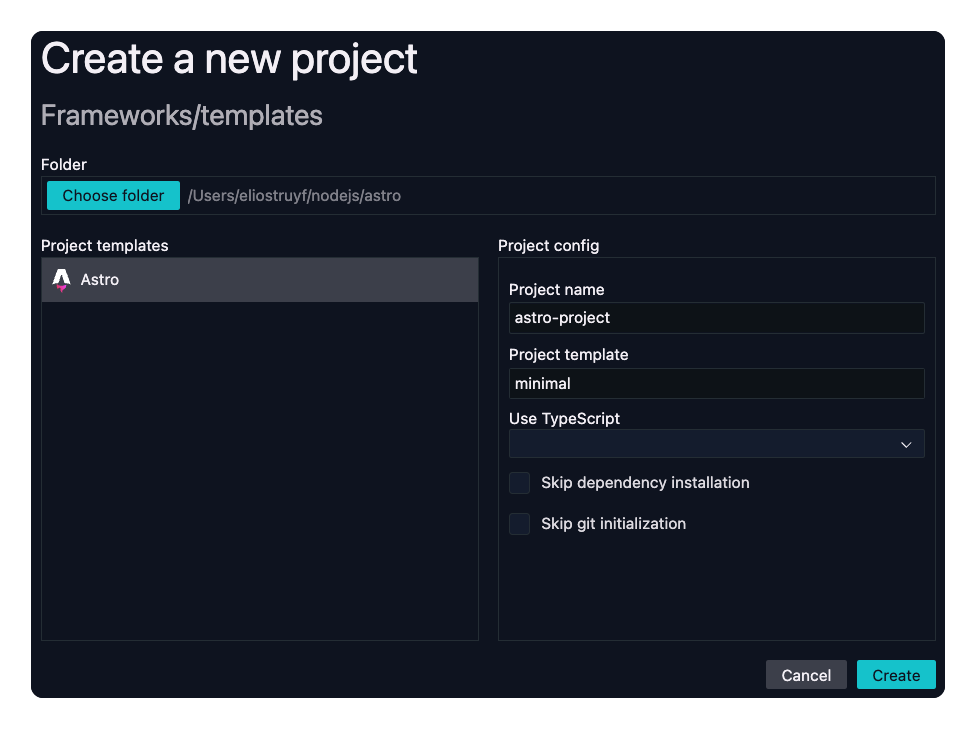

<h1 align="center">
  
</h1>

# Visual Studio Code - Project Creation

This extension allows you to create a new project from our available templates without the need to leave Visual Studio Code or open your terminal.

  

## Supported frameworks

| Template | Categories | Languages |
| --- | --- | --- |
| [Astro](https://astro.build) | `astro`, `ssg` | `typescript` |

## How to use

1. Open the command palette (Ctrl+Shift+P)
2. Type `Project Creation: New...`
3. Select the folder where you want to create new projects
4. Select the framework you want to use
5. Enter the project details
6. Click the `Create` button and wait for the project to be created 🚀

## Configuration

You can configure the extension to ignore template categories and/or languages.

| Setting | Description | Default |
| --- | --- | --- |
| `projectCreation.categories.ignore` | List of template categories to ignore | `[]` |
| `projectCreation.languages.ignore` | List of template languages to ignore | `[]` |
